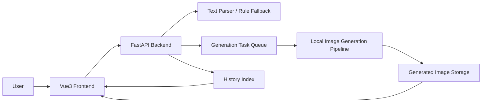

# InkLandscapeGen


Last updated: 2026-06-01

InkLandscapeGen is a full-stack creative workspace for Chinese landscape painting generation. It turns poems or natural-language prompts into editable scene structures, schedules image-generation tasks asynchronously, and provides history management, multi-image comparison, runtime status, and Chinese/English UI switching.

<p align="center">
  
</p>

## Highlights

| Area | What it provides |
| --- | --- |
| Creative input | Poem or natural-language prompt input with configurable style, composition, size, seed, steps, detail level, blank-space level, and negative prompt. |
| Scene structure | Editable entities, expanded imagery, attributes, spatial relations, layout hints, and style hints. |
| Generation workflow | Asynchronous task queue, progress polling, queue capacity control, and task status tracking. |
| Result management | Generated image preview, history records, parameter reuse, image deletion, QR code output, and multi-image comparison. |
| Runtime visibility | Backend status, parser mode, inference device, GPU memory, and queue capacity display. |
| Interface | Modern Vue3 workspace with icon-based controls and Chinese/English language switching. |

## Architecture



## Repository Layout

```text
InkLandscapeGen/
  backend/     FastAPI service, generation routes, parser, image storage helpers
  frontend/    Vue3 workspace, controls, progress view, history, comparison UI
  README.md    Project overview and quick start
```

## Quick Start

### 1. Backend

```bash
cd backend
python -m venv .venv
source .venv/bin/activate
pip install -r requirements.txt
```

For a fast UI demo without loading a local image model:

```bash
MOCK_GENERATION=1 uvicorn app.main:app --host 127.0.0.1 --port 8000
```

For local model inference:

```bash
IMAGE_MODEL_DIR=/path/to/local/image-model \
GENERATED_IMAGE_DIR=/path/to/generated/images \
uvicorn app.main:app --host 127.0.0.1 --port 8000
```

Health check:

```bash
curl -s http://127.0.0.1:8000/api/v1/health
```

### 2. Frontend

```bash
cd frontend
npm install
npm run serve
```

Open:

```text
http://127.0.0.1:1024/
```

If your backend is not running at `http://127.0.0.1:8000`, set:

```bash
VUE_APP_API_BASE=http://your-backend-host:8000 npm run build
```

## Configuration

| Variable | Default | Description |
| --- | --- | --- |
| `IMAGE_MODEL_DIR` | local model path | Path to the local image-generation model. |
| `GENERATED_IMAGE_DIR` | backend default | Directory for generated images and history metadata. Set this explicitly in deployment. |
| `MOCK_GENERATION` | `0` | Set to `1` to use a lightweight mock image generator. |
| `IMAGE_CPU_OFFLOAD` | `0` | Set to `1` to reduce GPU memory pressure with CPU offload. |
| `MAX_GENERATION_QUEUE` | `8` | Maximum number of active queued/running generation tasks. |
| `MAX_TASK_RECORDS` | `80` | Maximum in-memory task records retained by the backend. |
| `MAX_HISTORY_RECORDS` | `120` | Maximum history records persisted in `history.json`. |
| `CORS_ORIGINS` | `*` | Allowed frontend origins. Use comma-separated URLs in deployment. |
| `DEEPSEEK_API_KEY` | empty | Optional key for text semantic parsing. |
| `ZHIPUAI_API_KEY` | empty | Optional key for legacy text expansion helpers. |
| `BAIDU_TRANSLATE_APP_ID` | empty | Optional Baidu Translate app id. |
| `BAIDU_TRANSLATE_API_KEY` | empty | Optional Baidu Translate key. |

## API Overview

| Method | Endpoint | Purpose |
| --- | --- | --- |
| `GET` | `/api/v1/health` | Backend, parser, device, GPU memory, and queue status. |
| `POST` | `/api/v1/scene-graph` | Parse text into editable scene structure. |
| `POST` | `/api/v1/tasks` | Create an asynchronous generation task. |
| `GET` | `/api/v1/tasks` | List recent tasks. |
| `GET` | `/api/v1/tasks/{task_id}` | Poll task status and result. |
| `GET` | `/api/v1/history` | List generated image history. |
| `DELETE` | `/api/v1/history/{filename}` | Delete an image and its history record. |
| `GET` | `/images/{filename}` | Serve generated image files. |

## Notes

- This repository does not include model weights. Set `IMAGE_MODEL_DIR` to your local model directory.
- The `.env` file is intentionally ignored. Keep API keys and deployment secrets outside version control.
- `MOCK_GENERATION=1` is recommended for interface testing and screenshots.
- For production deployment, restrict `CORS_ORIGINS`, place generated images in a persistent storage directory, and run the backend behind a process manager or container runtime.

## Module Docs

- [Backend README](backend/README.md)
- [Frontend README](frontend/README.md)
