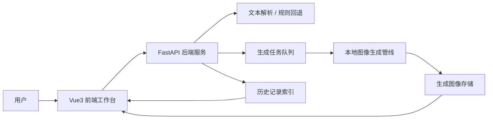
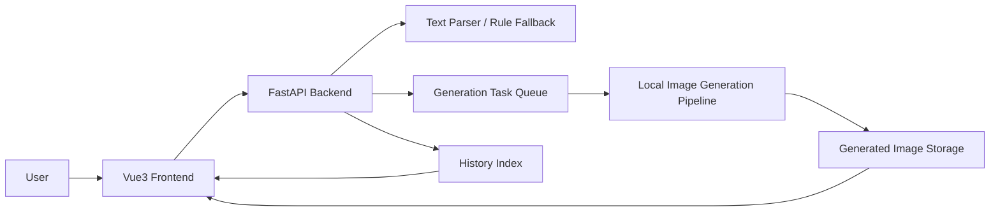

# InkLandscapeGen


[](#中文)
[](#english)

<a id="中文"></a>

## 中文

更新日期：2026-06-01

InkLandscapeGen 是一个面向中国山水画生成的全栈创作工作台。它可以将诗词或自然语言描述转化为可编辑的场景结构，并通过异步任务队列完成图像生成，同时提供历史记录、多图对比、运行状态监控和中英双语界面。

### 功能亮点

| 模块 | 能力 |
| --- | --- |
| 创作输入 | 支持诗词或自然语言描述，并可配置风格、构图、尺寸、随机种子、推理步数、细节强度、留白强度和反向提示词。 |
| 场景结构 | 支持编辑显式意象、补全意象、画面属性、空间关系、布局线索和风格提示。 |
| 生成流程 | 支持异步任务队列、进度轮询、队列容量控制和任务状态追踪。 |
| 结果管理 | 支持生成图预览、历史记录、参数复用、图像删除、二维码输出和多图对比。 |
| 运行监控 | 展示后端服务、文本解析模式、推理设备、显存占用和队列容量。 |
| 用户界面 | 基于 Vue3 的现代化工作台，包含图标化操作和中英双语切换。 |

### 系统架构



### 项目结构

```text
InkLandscapeGen/
  backend/     FastAPI 服务、生成路由、文本解析和图像管理
  frontend/    Vue3 工作台、参数控制、进度展示、历史记录和多图对比
  README.md    项目概览和快速启动说明
```

### 快速启动

启动后端：

```bash
cd backend
python -m venv .venv
source .venv/bin/activate
pip install -r requirements.txt
```

如果只想快速体验界面，不加载本地图像模型：

```bash
MOCK_GENERATION=1 uvicorn app.main:app --host 127.0.0.1 --port 8000
```

如果使用本地模型推理：

```bash
IMAGE_MODEL_DIR=/path/to/local/image-model \
GENERATED_IMAGE_DIR=/path/to/generated/images \
uvicorn app.main:app --host 127.0.0.1 --port 8000
```

启动前端：

```bash
cd frontend
npm install
npm run serve
```

访问：

```text
http://127.0.0.1:1024/
```

### 常用配置

| 变量 | 默认值 | 说明 |
| --- | --- | --- |
| `IMAGE_MODEL_DIR` | 本地模型路径 | 本地图像生成模型目录。 |
| `GENERATED_IMAGE_DIR` | 后端默认路径 | 生成图像和历史元数据保存目录，部署时建议显式设置。 |
| `MOCK_GENERATION` | `0` | 设置为 `1` 时启用轻量级模拟生成。 |
| `IMAGE_CPU_OFFLOAD` | `0` | 设置为 `1` 时启用 CPU offload 以降低显存压力。 |
| `MAX_GENERATION_QUEUE` | `8` | 最大等待/运行任务数量。 |
| `MAX_TASK_RECORDS` | `80` | 后端内存中保留的最大任务记录数。 |
| `MAX_HISTORY_RECORDS` | `120` | `history.json` 中保留的最大历史记录数。 |
| `CORS_ORIGINS` | `*` | 允许访问后端的前端来源，部署时建议收紧。 |
| `DEEPSEEK_API_KEY` | 空 | 可选文本语义解析服务密钥。 |
| `ZHIPUAI_API_KEY` | 空 | 可选文本扩展辅助服务密钥。 |
| `BAIDU_TRANSLATE_APP_ID` | 空 | 可选百度翻译 App ID。 |
| `BAIDU_TRANSLATE_API_KEY` | 空 | 可选百度翻译密钥。 |

### API 概览

| 方法 | 接口 | 用途 |
| --- | --- | --- |
| `GET` | `/api/v1/health` | 查看后端、解析器、设备、显存和队列状态。 |
| `POST` | `/api/v1/scene-graph` | 将文本解析为可编辑场景结构。 |
| `POST` | `/api/v1/tasks` | 创建异步生成任务。 |
| `GET` | `/api/v1/tasks` | 查看近期任务列表。 |
| `GET` | `/api/v1/tasks/{task_id}` | 轮询任务状态和生成结果。 |
| `GET` | `/api/v1/history` | 查看生成历史。 |
| `DELETE` | `/api/v1/history/{filename}` | 删除图像及其历史记录。 |
| `GET` | `/images/{filename}` | 读取生成图像文件。 |

### 说明

- 仓库不包含模型权重，请通过 `IMAGE_MODEL_DIR` 指向本地模型目录。
- `.env` 已被忽略，请不要将 API Key 或部署密钥提交到仓库。
- 界面测试和截图建议使用 `MOCK_GENERATION=1`。
- 部署时建议限制 `CORS_ORIGINS`，并将生成图像目录放在持久化存储中。

### 模块文档

- [后端说明](backend/README.md)
- [前端说明](frontend/README.md)

<a id="english"></a>

## English

Last updated: 2026-06-01

InkLandscapeGen is a full-stack creative workspace for Chinese landscape painting generation. It turns poems or natural-language prompts into editable scene structures, schedules image-generation tasks asynchronously, and provides history management, multi-image comparison, runtime status, and Chinese/English UI switching.

### Highlights

| Area | What it provides |
| --- | --- |
| Creative input | Poem or natural-language prompt input with configurable style, composition, size, seed, steps, detail level, blank-space level, and negative prompt. |
| Scene structure | Editable entities, expanded imagery, attributes, spatial relations, layout hints, and style hints. |
| Generation workflow | Asynchronous task queue, progress polling, queue capacity control, and task status tracking. |
| Result management | Generated image preview, history records, parameter reuse, image deletion, QR code output, and multi-image comparison. |
| Runtime visibility | Backend status, parser mode, inference device, GPU memory, and queue capacity display. |
| Interface | Modern Vue3 workspace with icon-based controls and Chinese/English language switching. |

### Architecture



### Repository Layout

```text
InkLandscapeGen/
  backend/     FastAPI service, generation routes, parser, image storage helpers
  frontend/    Vue3 workspace, controls, progress view, history, comparison UI
  README.md    Project overview and quick start
```

### Quick Start

Start the backend:

```bash
cd backend
python -m venv .venv
source .venv/bin/activate
pip install -r requirements.txt
```

For a fast UI demo without loading a local image model:

```bash
MOCK_GENERATION=1 uvicorn app.main:app --host 127.0.0.1 --port 8000
```

For local model inference:

```bash
IMAGE_MODEL_DIR=/path/to/local/image-model \
GENERATED_IMAGE_DIR=/path/to/generated/images \
uvicorn app.main:app --host 127.0.0.1 --port 8000
```

Start the frontend:

```bash
cd frontend
npm install
npm run serve
```

Open:

```text
http://127.0.0.1:1024/
```

If your backend is not running at `http://127.0.0.1:8000`, set:

```bash
VUE_APP_API_BASE=http://your-backend-host:8000 npm run build
```

### Configuration

| Variable | Default | Description |
| --- | --- | --- |
| `IMAGE_MODEL_DIR` | local model path | Path to the local image-generation model. |
| `GENERATED_IMAGE_DIR` | backend default | Directory for generated images and history metadata. Set this explicitly in deployment. |
| `MOCK_GENERATION` | `0` | Set to `1` to use a lightweight mock image generator. |
| `IMAGE_CPU_OFFLOAD` | `0` | Set to `1` to reduce GPU memory pressure with CPU offload. |
| `MAX_GENERATION_QUEUE` | `8` | Maximum number of active queued/running generation tasks. |
| `MAX_TASK_RECORDS` | `80` | Maximum in-memory task records retained by the backend. |
| `MAX_HISTORY_RECORDS` | `120` | Maximum history records persisted in `history.json`. |
| `CORS_ORIGINS` | `*` | Allowed frontend origins. Use comma-separated URLs in deployment. |
| `DEEPSEEK_API_KEY` | empty | Optional key for text semantic parsing. |
| `ZHIPUAI_API_KEY` | empty | Optional key for legacy text expansion helpers. |
| `BAIDU_TRANSLATE_APP_ID` | empty | Optional Baidu Translate app id. |
| `BAIDU_TRANSLATE_API_KEY` | empty | Optional Baidu Translate key. |

### API Overview

| Method | Endpoint | Purpose |
| --- | --- | --- |
| `GET` | `/api/v1/health` | Backend, parser, device, GPU memory, and queue status. |
| `POST` | `/api/v1/scene-graph` | Parse text into editable scene structure. |
| `POST` | `/api/v1/tasks` | Create an asynchronous generation task. |
| `GET` | `/api/v1/tasks` | List recent tasks. |
| `GET` | `/api/v1/tasks/{task_id}` | Poll task status and result. |
| `GET` | `/api/v1/history` | List generated image history. |
| `DELETE` | `/api/v1/history/{filename}` | Delete an image and its history record. |
| `GET` | `/images/{filename}` | Serve generated image files. |

### Notes

- This repository does not include model weights. Set `IMAGE_MODEL_DIR` to your local model directory.
- The `.env` file is intentionally ignored. Keep API keys and deployment secrets outside version control.
- `MOCK_GENERATION=1` is recommended for interface testing and screenshots.
- For production deployment, restrict `CORS_ORIGINS`, place generated images in a persistent storage directory, and run the backend behind a process manager or container runtime.

### Module Docs

- [Backend README](backend/README.md)
- [Frontend README](frontend/README.md)
